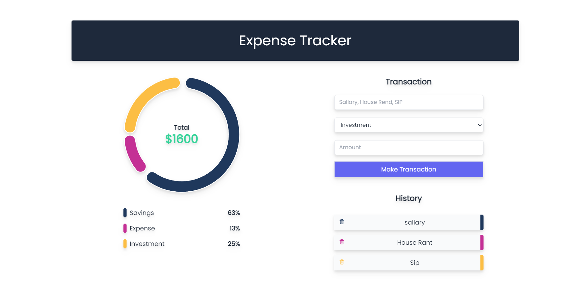

# Interface of Expense Tracker



# Expense Tracker React

## Description

Setup Procedure

## Project setup

```
npm install
```

### Compiles and hot-reloads for development

```
npm run start
```

### Compiles and minifies for production

```
npm run build
```

### Lints and fixes files

```
npm run lint
```
